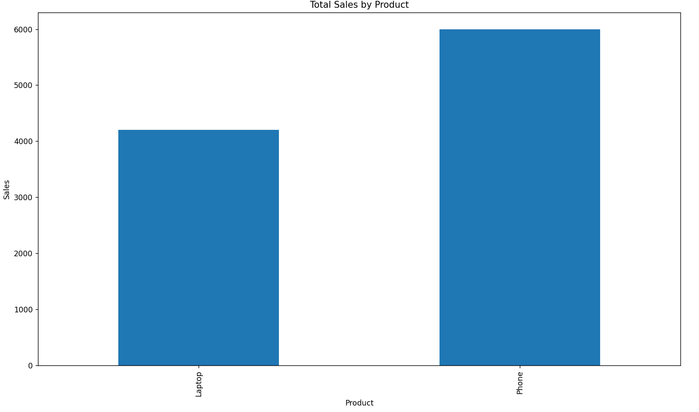

# Sales Data Analysis

This project analyzes a small sales dataset using Python.

The objective is to practice basic data analysis techniques such as data exploration, aggregation, and visualization.

## Tools Used

- Python
- Pandas
- Matplotlib

## Dataset

The dataset contains monthly sales data for two products.

Columns included:
- Month
- Product
- Sales

## Analysis Performed

The analysis includes:

- Loading data from a CSV file
- Exploring the dataset
- Calculating total sales by product
- Creating a bar chart to visualize the results

## Results

From the analysis we observed:

- The phone generated higher total sales than the laptop.
- Sales increased in the later months.

## Visualization

The program generates a bar chart showing total sales by product.

## How to Run

1. Install required libraries

2. Run the script

## Project Structure
sales-data-analysis

- ├──analysis.py
- ├──sales_data.csv
- ├── sales_chart.png
- ├──README.md

## Author

Raúl Aldemar Macías  
Mechatronics Engineering Student interested in Data Analysis.
## Visualization

